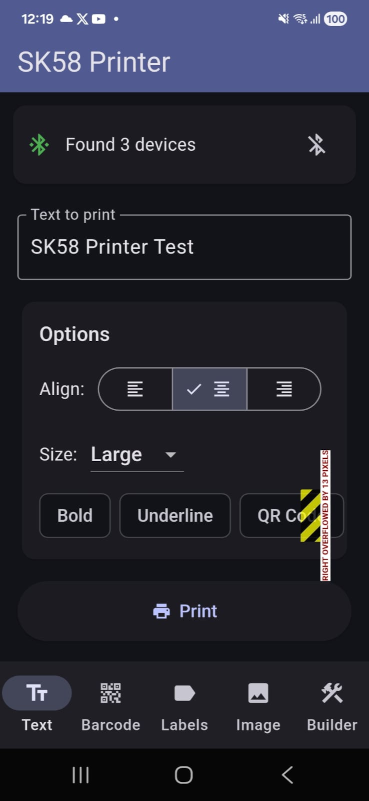
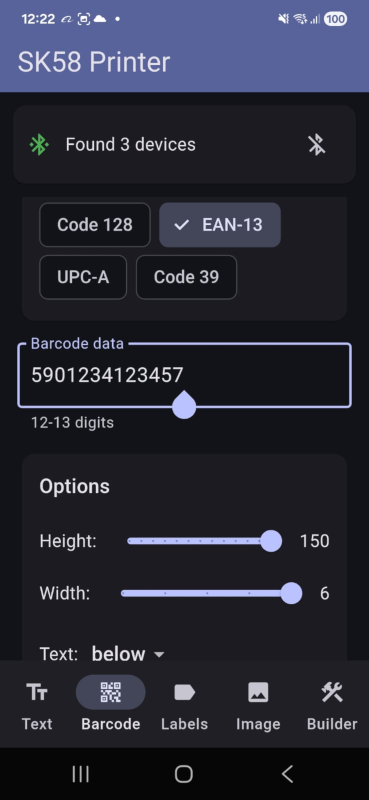
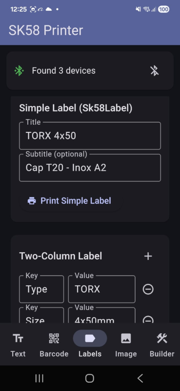
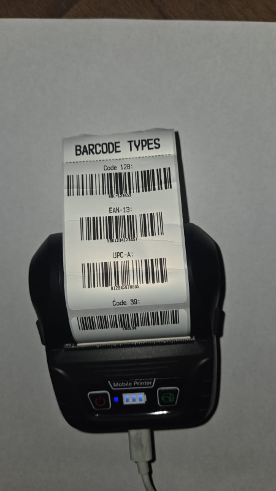
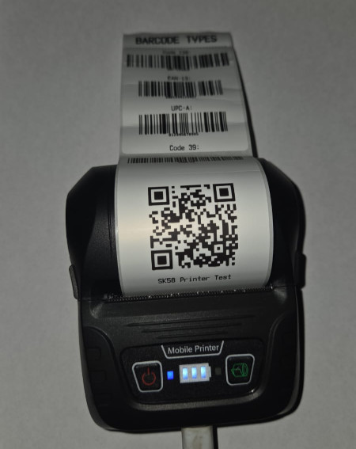
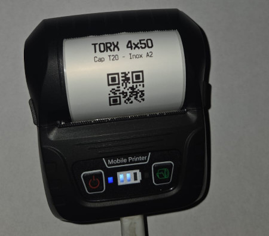

# SK58 Printer

Flutter library for SK58 thermal printer via Bluetooth.

## Features

- 🔍 Bluetooth device scanning with permission handling
- 🔌 Connect/disconnect to SK58 thermal printer
- 📝 Print text with styles (bold, underline, sizes) and alignment
- 📊 Print barcodes (Code128, EAN-13, UPC-A, Code39)
- 📱 Print QR codes
- 🖼️ Print images with Floyd-Steinberg dithering
- 🏷️ Generic label templates (Sk58Label, Sk58TwoColumnLabel)
- 🔧 Fluent builder pattern for complex prints
- ✅ Support for Android and Linux

## Screenshots

### App Interface

| Main Screen | Barcode Demo | Labels Demo |
|-------------|--------------|-------------|
|  |  |  |

### Print Examples

| Barcode Print | QR Code | Label |
|---------------|---------|-------|
|  |  |  |

### Receipt Demo (Builder Pattern)


## Installation

Add to your `pubspec.yaml`:

```yaml
dependencies:
  sk58_printer: ^0.2.0
```

Then run:

```bash
flutter pub get
```

### From Git (development version)

If you want to use the latest development version from GitHub:

```yaml
dependencies:
  sk58_printer:
    git:
      url: https://github.com/mosulache/sk58_printer.git
      ref: main
```

## Quick Start

```dart
import 'package:sk58_printer/sk58_printer.dart';

// Create scanner and scan for devices
final scanner = Sk58Scanner();
await scanner.startScan();

// Listen for discovered devices
scanner.deviceStream.listen((device) {
  print('Found: ${device.name}');
});

// Connect to a device
final printer = await Sk58Printer.connect(device);

// Print text
await printer.printText('Hello World!');
await printer.printText('Centered', align: Sk58Align.center);

// Print QR code
await printer.printQrCode('https://example.com');

// Feed paper and disconnect
await printer.feedLines(3);
await printer.disconnect();
```

## Advanced Usage

### Print Barcodes

```dart
// Code 128 (alphanumeric)
await printer.printBarcode('ABC-12345', type: BarcodeType.code128);

// EAN-13 (13 digits)
await printer.printBarcode('5901234123457', type: BarcodeType.ean13);

// UPC-A (12 digits)
await printer.printBarcode('012345678905', type: BarcodeType.upcA);

// Code 39
await printer.printBarcode('CODE39', type: BarcodeType.code39);
```

### Print Images

```dart
final imageBytes = await File('logo.png').readAsBytes();

// Print with dithering (better for photos/grayscale)
await printer.printImage(imageBytes, dithering: true);

// Print with threshold (better for logos/line art)
await printer.printImage(imageBytes, dithering: false, threshold: 128);

// Resize to specific width
await printer.printImage(imageBytes, maxWidth: 200);

// For mobile printers or small labels, use bandMode for reliable printing
await printer.printImage(imageBytes, maxWidth: 280, bandMode: true);
```

> **Note:** Use `bandMode: true` for mobile thermal printers or when printing on small labels (e.g., 40x15mm). This sends the image in smaller chunks using ESC * 33 (24-dot double density) which is more reliable for printers with limited buffers.

### Use Templates

```dart
// Simple label
await printer.printTemplate(
  Sk58Label(
    title: 'TORX 4x50',
    subtitle: 'Cap T20 - Inox A2',
    qrData: 'SKU-12345',
  ),
);

// Two-column label
await printer.printTemplate(
  Sk58TwoColumnLabel(
    title: 'Product Info',
    rows: [
      ('Type', 'TORX'),
      ('Size', '4x50mm'),
      ('Head', 'T20'),
    ],
  ),
);
```

### Builder Pattern (for complex prints)

```dart
await printer.build()
  .header('DEMO STORE')
  .text('123 Main Street', align: Sk58Align.center)
  .doubleLine()
  .text('RECEIPT', style: Sk58TextStyle.boldStyle, align: Sk58Align.center)
  .line()
  .row('Coffee', '\$3.50')
  .row('Sandwich', '\$8.00')
  .line()
  .row('TOTAL', '\$11.50')
  .feed(1)
  .qrCode('https://receipt.example.com/12345')
  .feed(3)
  .execute();
```

## Text Styles

```dart
// Bold text
await printer.printText('Bold', style: Sk58TextStyle.boldStyle);

// Large text
await printer.printText('Large', style: const Sk58TextStyle(size: Sk58FontSize.large));

// Combined styles
await printer.printText(
  'Bold + Underline',
  style: const Sk58TextStyle(bold: true, underline: true),
);

// Available sizes: normal, wide, tall, large
```

## Platform Setup

### Android

Add to `android/app/src/main/AndroidManifest.xml`:

```xml
<uses-permission android:name="android.permission.BLUETOOTH_SCAN" />
<uses-permission android:name="android.permission.BLUETOOTH_CONNECT" />
<uses-permission android:name="android.permission.ACCESS_FINE_LOCATION" />
```

### Linux

Ensure BlueZ is installed and your user has bluetooth permissions:

```bash
sudo apt install bluez
sudo usermod -a -G bluetooth $USER
```

!! linux support requires more testing / documentation

## Example App

The `example/` folder contains a complete demo app with:
- Text printing with styles
- Barcode printing (all types)
- Image printing with dithering options
- Simple Label templates
- Builder pattern demos

Run it:

```bash
cd example
flutter run
```

## API Reference

### Sk58Printer

| Method | Description |
|--------|-------------|
| `connect(device)` | Connect to a BLE device |
| `disconnect()` | Disconnect from printer |
| `printText(text, {style, align})` | Print text |
| `printQrCode(data, {size})` | Print QR code |
| `printBarcode(data, {type, height, width})` | Print barcode |
| `printImage(bytes, {maxWidth, dithering, bandMode})` | Print image |
| `printTemplate(template)` | Print a template |
| `build()` | Get a print builder |
| `feedLines(n)` | Feed n lines |
| `printLine({char})` | Print horizontal line |

### Sk58Scanner

| Method | Description |
|--------|-------------|
| `startScan()` | Start scanning for devices |
| `stopScan()` | Stop scanning |
| `deviceStream` | Stream of discovered devices |

## Third-Party Licenses

This project uses the following open-source libraries:

- **[universal_ble](https://pub.dev/packages/universal_ble)** - BSD-3-Clause License ([license](https://opensource.org/licenses/BSD-3-Clause))
- **[permission_handler](https://pub.dev/packages/permission_handler)** - MIT License ([license](https://opensource.org/licenses/MIT))
- **[image](https://pub.dev/packages/image)** - MIT License ([license](https://opensource.org/licenses/MIT))
- **[flutter_lints](https://pub.dev/packages/flutter_lints)** - BSD-3-Clause License ([license](https://opensource.org/licenses/BSD-3-Clause))

## License

MIT License
